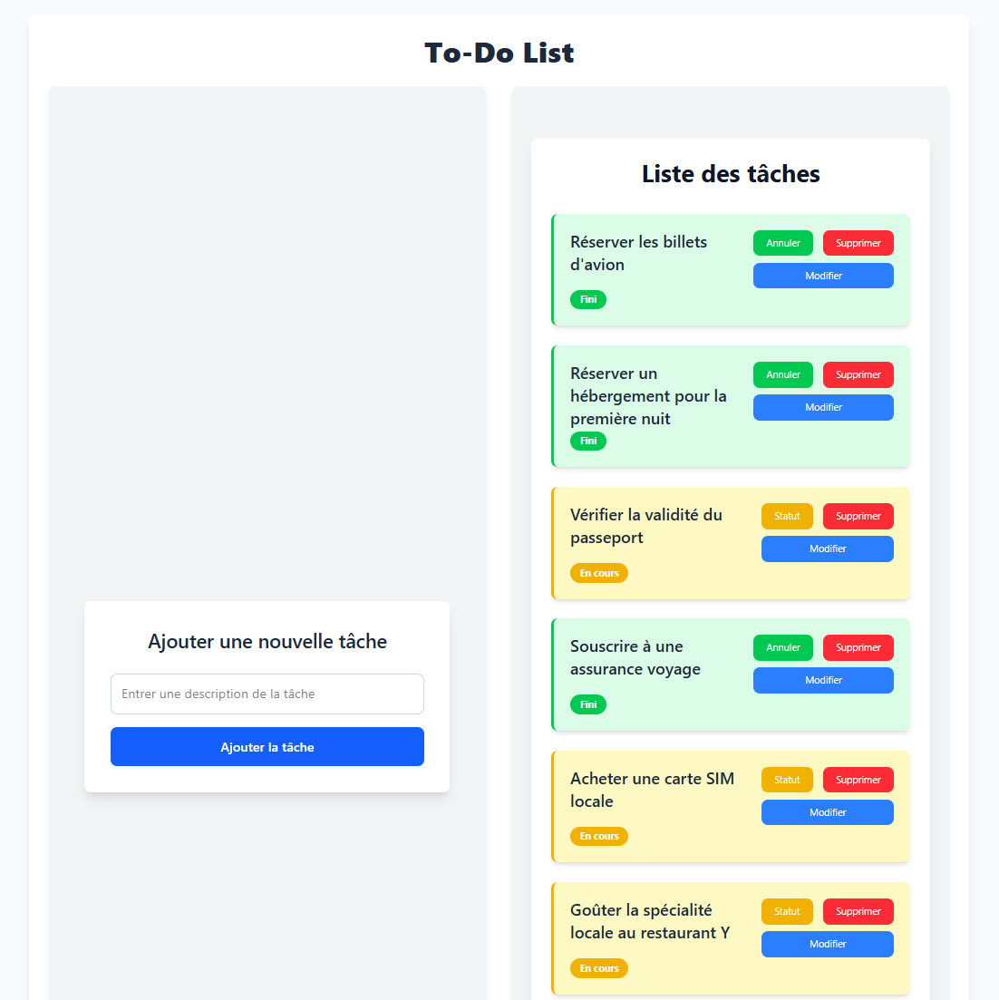

# Todolist avec Node.js, React et Tailwind

Ce projet est une application de **ToDo List** développée avec **React** pour le frontend, **Node.js** pour le backend, et **Vite.js** comme outil de construction et de développement.

L'application permet aux utilisateurs de créer, lire, mettre à jour et supprimer des tâches. Le frontend est construit avec React, tandis que le backend utilise Node.js et un serveur Express pour gérer les opérations liées aux tâches.

## Aperçu du projet

Voici à quoi ressemble l'interface du todolist :



## Fonctionnalités

- Ajouter, modifier et supprimer des tâches.
- Marquer les tâches comme complètes.
- Stockage des données côté serveur avec une API RESTful en Node.js.
- Développement rapide avec Vite.js.

## Architecture du projet

Le projet est divisé en deux parties principales : le frontend et le backend.

### Frontend (React + Vite.js + tailwind)
- **React** : Bibliothèque JavaScript pour construire l'interface utilisateur.
- **Vite.js** : Outil de développement rapide pour React, offrant un rechargement à chaud et une compilation optimisée.
- **Tailwind** : Framework CSS utilitaire-first qui permet de créer rapidement des interfaces personnalisées en utilisant des classes utilitaires pré-définies, offrant ainsi flexibilité et contrôle sur la mise en page et le style sans écrire de CSS personnalisé.

### Backend (Node.js + Express)
- **Node.js** : Environnement d'exécution JavaScript côté serveur.
- **Express** : Framework minimaliste pour construire des API RESTful.


## Prérequis

Avant de commencer, vous devez avoir les éléments suivants installés sur votre machine :

- [Node.js](https://nodejs.org/) (version 14 ou supérieure)
- [npm](https://www.npmjs.com/) ou [Yarn](https://yarnpkg.com/) pour la gestion des paquets

## Installation

### 1. Cloner le repository

Clonez ce repository sur votre machine locale :

```bash
git clone https://github.com/yourusername/todolist-app.git
cd todolist
```

## 2. Installation des dépendances

### Pour le backend (Node.js) :

```bash
cd backend
npm install
```

### Pour le frontend (React + Vite.js) :

```bash
cd frontend
npm install
```

## 3. Démarrer le projet

### Démarrer le backend (Node.js) :

```bash
cd backend
npm start
```

### Démarrer le frontend (React + Vite.js) :

```bash
cd frontend
npm run dev
```
